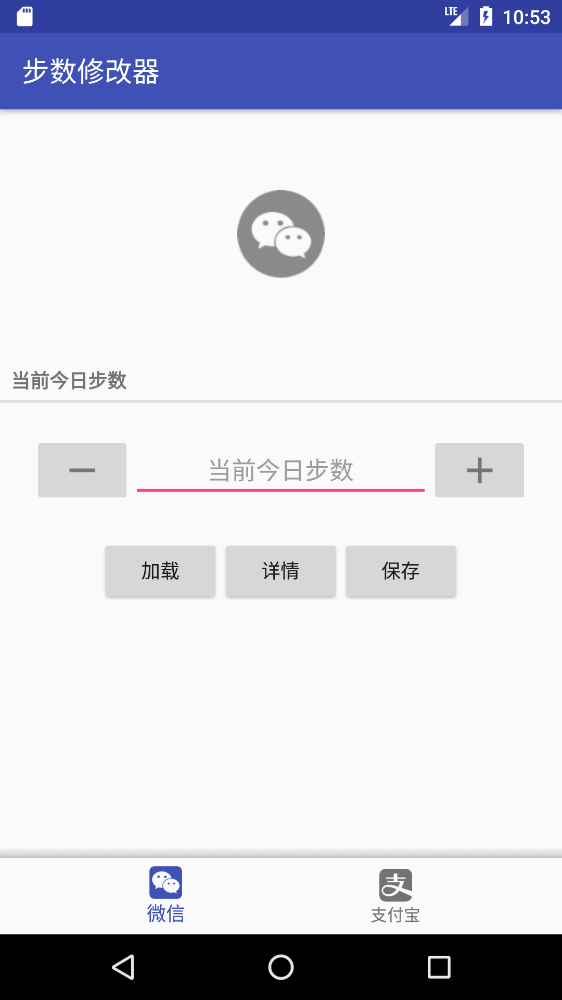
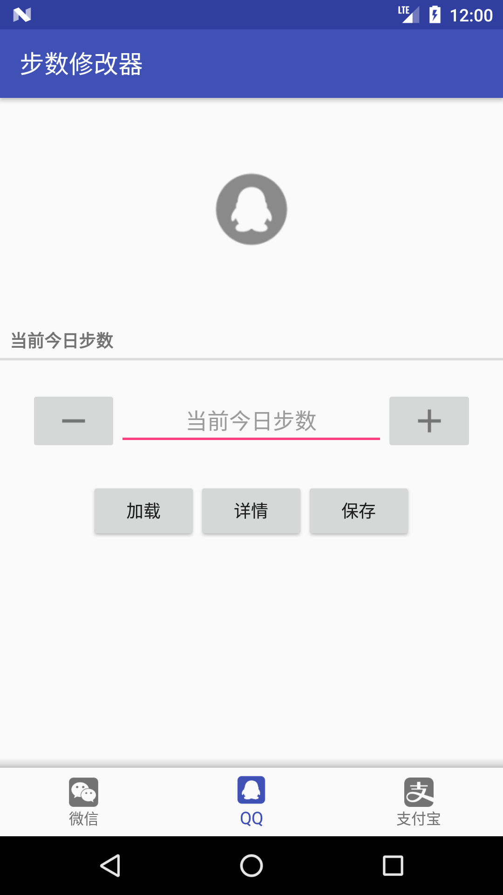
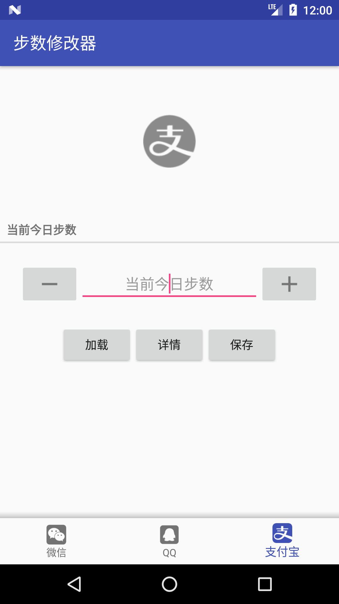

# 运动修改器

## 下载
[步数修改器](https://github.com/iweizime/StepChanger/releases)

## 注意

- 需要手机支持`Step Counter Sensor`

- 需要`Root`权限

- 不要一次改的太多，会被检测为异常

支持Android 5.1以上系统，仅在Android 7.x系统上测试过。

## 界面

    
    
    
    
    
    

